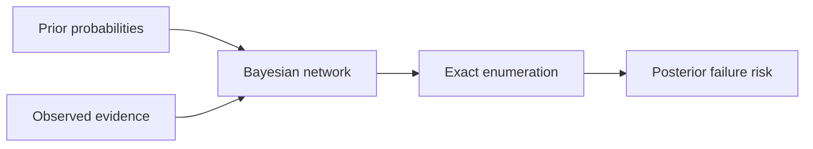

# Probabilistic Risk Inference

[](https://www.python.org/) [](#testing) [](LICENSE)

> Estimate operational failure risk from uncertain evidence with a small Bayesian network.

## Why this project exists

An operations system combines signals such as elevated workload and anomaly indicators to update the probability of failure.

The implementation is intentionally small and reproducible so the underlying AI reasoning is easy to inspect, benchmark, and discuss.

## AI concepts demonstrated

Bayesian networks, priors, conditional probabilities, joint probability, evidence conditioning, exact enumeration

## Architecture



## Results

| Evidence | P(Failure) |
|---|---:|
| None | 0.266 |
| HighLoad = True | 0.600 |
| Anomaly = True | 0.508 |
| HighLoad = True, Anomaly = True | 0.800 |

## Project structure

```text
probabilistic-risk-inference/
├── README.md
├── LICENSE
├── requirements.txt
├── examples/
│   └── demo.py
├── src/
│   └── implementation
└── tests/
    └── test_*.py
```

## Run locally

```bash
python -m venv .venv
# macOS/Linux
source .venv/bin/activate
# Windows PowerShell
# .venv\Scripts\Activate.ps1

pip install -r requirements.txt
PYTHONPATH=. python examples/demo.py
```

## Testing

```bash
PYTHONPATH=. pytest -q
```

## Ideas for extending the project

- Scale the environment or dataset and compare runtime and search behavior.
- Add richer visualizations or an interactive interface.
- Introduce additional baselines and ablation experiments.
- Add configuration files so experiments are reproducible from the command line.

## Portfolio note

This project is independently structured and documented as a portfolio implementation inspired by AI concepts studied in CS221. Do not publish course-provided starter code, solutions, tests, or restricted materials.

## GitHub metadata

**Repository name**

`probabilistic-risk-inference`

**Description**

`Estimate operational failure risk from uncertain evidence with a small Bayesian network.`

**Topics**

`artificial-intelligence` `bayesian-networks` `probabilistic-inference` `probability` `uncertainty` `python` `machine-learning` `cs221`
